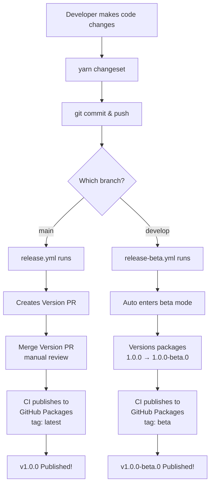
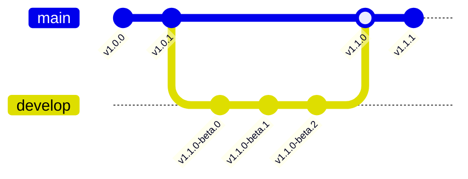

# Release Workflow

## Overview

Both stable and beta releases are **fully automated** via CI/CD.

| Branch    | Release Type | npm Tag  | Example Version |
| --------- | ------------ | -------- | --------------- |
| `main`    | Stable       | `latest` | 1.0.0           |
| `develop` | Beta         | `beta`   | 1.0.0-beta.0    |

---

## Automated Release Flow

> **Both releases are fully automatic via CI/CD**



---

## Step-by-Step Workflows

### Stable Release (main branch) - Automatic

```bash
# 1. Make changes on feature branch
git checkout -b feat/my-feature

# 2. Create changeset
yarn changeset
# Select packages, bump type (patch/minor/major), write summary

# 3. Commit and push
git add .
git commit -m "feat: add new feature"
git push -u origin feat/my-feature

# 4. Create PR to main → Merge PR

# 5. CI automatically:
#    - Detects changesets
#    - Creates "Version PR"
#    - You merge Version PR
#    - Publishes v1.0.0 to GitHub Packages
```

### Beta Release (develop branch) - Automatic

```bash
# 1. Create/switch to develop branch
git checkout -b develop
# OR if develop exists:
git checkout develop
git merge main  # sync with main

# 2. Make changes
# ... code changes ...

# 3. Create changeset
yarn changeset

# 4. Commit and push
git add .
git commit -m "feat: beta feature"
git push -u origin develop

# 5. CI automatically:
#    - Enters beta prerelease mode (if not already)
#    - Versions to 1.0.0-beta.0
#    - Publishes with 'beta' tag

# 6. Subsequent pushes to develop → 1.0.0-beta.1, beta.2, etc.
```

### Promote Beta to Stable

```bash
# 1. On develop branch, exit prerelease mode
yarn prerelease:exit  # or: yarn changeset pre exit

# 2. Commit the pre.json removal
git add .changeset/
git commit -m "chore: exit beta prerelease"

# 3. Merge develop into main
git checkout main
git merge develop
git push

# 4. CI creates Version PR with stable version (1.0.0)
# 5. Merge Version PR → Published as stable!
```

---

## Branch Strategy



---

## Available Scripts

| Script                  | Description                  |
| ----------------------- | ---------------------------- |
| `yarn changeset`        | Create a new changeset       |
| `yarn version-packages` | Apply changesets to versions |
| `yarn release`          | Build and publish (stable)   |
| `yarn release:beta`     | Build and publish (beta tag) |
| `yarn prerelease:beta`  | Enter beta prerelease mode   |
| `yarn prerelease:exit`  | Exit prerelease mode         |

---

## CI/CD Workflows

| File               | Trigger                 | Action                              |
| ------------------ | ----------------------- | ----------------------------------- |
| `ci.yml`           | PR/Push to main/develop | Build, typecheck                    |
| `release.yml`      | Push to main            | Create Version PR or publish stable |
| `release-beta.yml` | Push to develop         | Auto-publish beta versions          |

---

## npm Install Commands

```bash
# Install stable (latest)
yarn add @mono-sdk/mono-1

# Install beta
yarn add @mono-sdk/mono-1@beta

# Install specific version
yarn add @mono-sdk/mono-1@1.0.0-beta.1
```

---

## Version Examples

| Action              | Before       | After        |
| ------------------- | ------------ | ------------ |
| Patch (bug fix)     | 1.0.0        | 1.0.1        |
| Minor (new feature) | 1.0.0        | 1.1.0        |
| Major (breaking)    | 1.0.0        | 2.0.0        |
| Beta patch          | 1.0.0-beta.0 | 1.0.0-beta.1 |
| Beta to stable      | 1.0.0-beta.5 | 1.0.0        |
