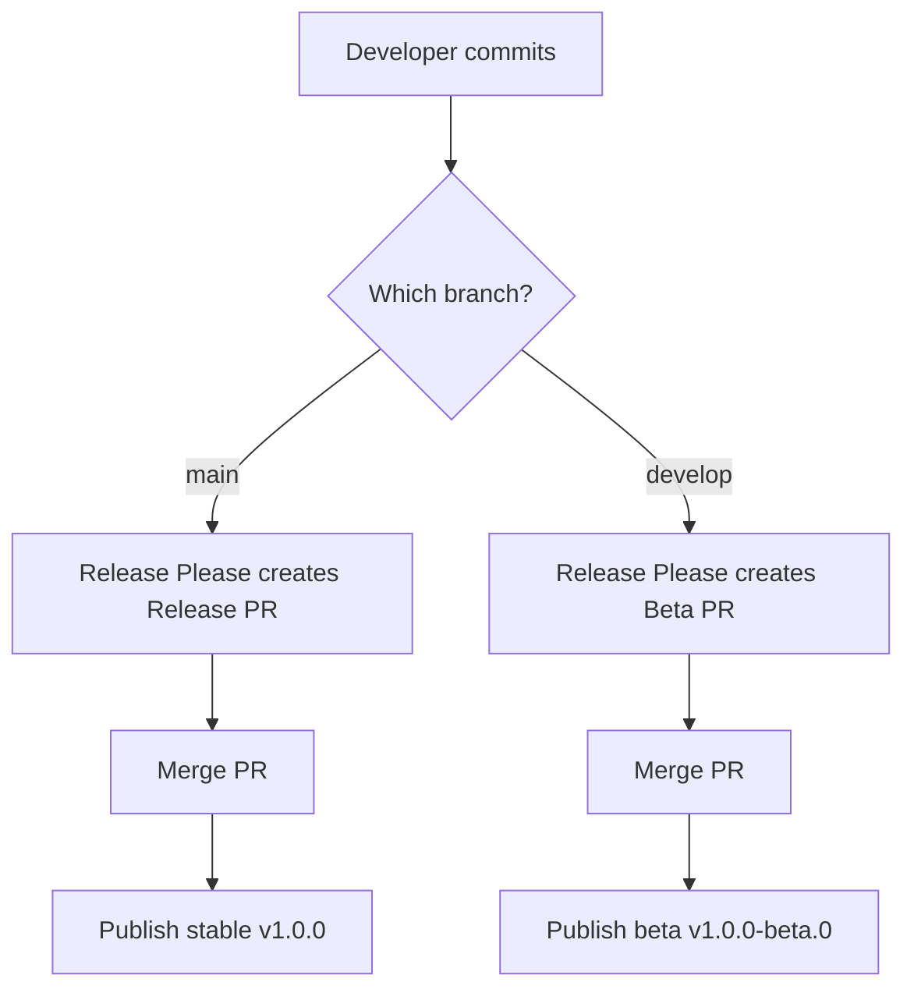

# Release Workflow

## Overview

Releases are **automated via Release Please** using conventional commits.

| Branch | Release Type | npm Tag | Example Version |
|--------|--------------|---------|-----------------|
| `main` | Stable | `latest` | 1.0.0 |
| `develop` | Beta | `beta` | 1.0.0-beta.0 |

| Commit Type | Version Bump | Example |
|-------------|--------------|---------|
| `fix:` | Patch | 1.0.0 → 1.0.1 |
| `feat:` | Minor | 1.0.0 → 1.1.0 |
| `feat!:` or `BREAKING CHANGE:` | Major | 1.0.0 → 2.0.0 |

---

## How It Works



---

## Stable Release (main branch)

```bash
# 1. Make changes with conventional commits
git commit -m "feat: add new API method"

# 2. Push to main
git push origin main

# 3. Release Please creates Release PR automatically

# 4. Merge the Release PR → packages published as stable!
```

---

## Beta Release (develop branch)

```bash
# 1. Create/switch to develop
git checkout develop

# 2. Make changes with conventional commits
git commit -m "feat: experimental feature"

# 3. Push to develop
git push origin develop

# 4. Release Please creates Beta Release PR

# 5. Merge → packages published with beta tag!
```

---

## Promote Beta to Stable

```bash
# 1. Merge develop into main
git checkout main
git merge develop
git push

# 2. Release Please creates stable Release PR

# 3. Merge → stable version published!
```

---

## Commit Message Format

```
<type>[optional scope]: <description>

[optional body]

[optional footer(s)]
```

### Types

| Type | Description | Version Bump |
|------|-------------|--------------|
| `feat` | New feature | Minor |
| `fix` | Bug fix | Patch |
| `docs` | Documentation only | None |
| `style` | Code style (formatting) | None |
| `refactor` | Code refactoring | None |
| `perf` | Performance improvement | Patch |
| `test` | Adding tests | None |
| `chore` | Maintenance | None |

### Breaking Changes

```bash
feat!: remove deprecated method
# OR
feat: update API

BREAKING CHANGE: method signature changed
```

---

## CI/CD Workflows

| File | Trigger | Action |
|------|---------|--------|
| `ci.yml` | PR/Push to main/develop | Lint, build, typecheck |
| `release.yml` | Push to main | Release Please + Publish stable |
| `release-beta.yml` | Push to develop | Release Please + Publish beta |

---

## Install Packages

```bash
# Install stable (latest)
yarn add @phathdt/mono-1

# Install beta
yarn add @phathdt/mono-1@beta

# Install specific version
yarn add @phathdt/mono-1@1.0.0-beta.0
```

---

## Configuration Files

| File | Purpose |
|------|---------|
| `release-please-config.json` | Package configuration |
| `.release-please-manifest.json` | Current versions tracking |
